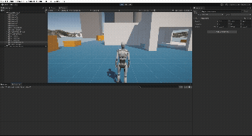

## Gif de Ejecución

## Descripción de la escena

La escena fue creada en el editor de Unity, cumpliendo con los siguientes requerimientos:

### Objetos 3D básicos
Se colocaron **cubos** y **cilindros** distribuidos en distintas posiciones para simular estructuras y elementos interactivos.

### Starter Assets
Se integró el paquete **Starter Assets – Third Person Controller**, que incluye un personaje con animaciones y control de cámara en tercera persona. El personaje se observa en el GIF desplazándose y reaccionando al terreno.

### Objeto adicional de la Asset Store
Se incorporó un **asset libre** distinto de los Starter Assets (por ejemplo, un árbol), ampliando la variedad visual de la escena.

### Terreno
Se generó un **terreno base** que sirve como superficie jugable, sobre el cual se posicionan los diferentes objetos.

### Etiquetas
Cada objeto 3D básico cuenta con una **etiqueta (tag) asignada**, permitiendo identificarlos fácilmente en el proyecto.

### Prefabs de Starter Assets
Se utilizaron **prefabs** del controlador en tercera persona para el personaje principal.

### Script personalizado
Se añadió un **script en C#** que recorre los objetos de la escena y escribe en la consola de Unity tanto la etiqueta como la posición de cada uno.