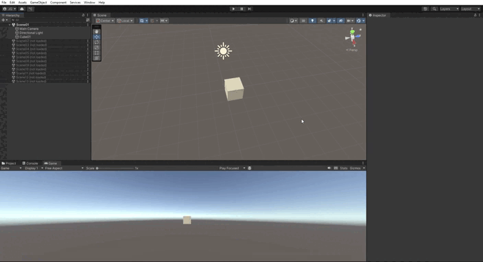
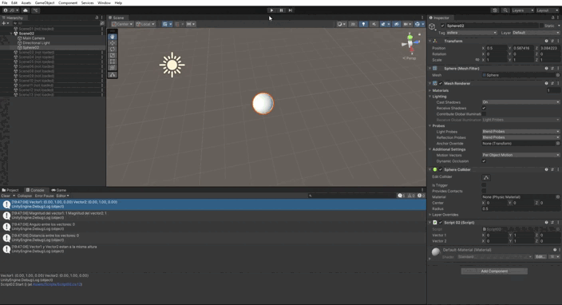
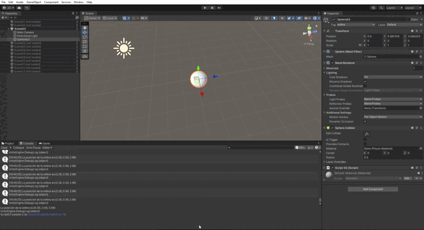
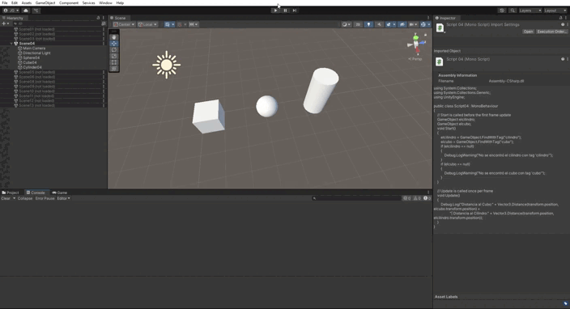
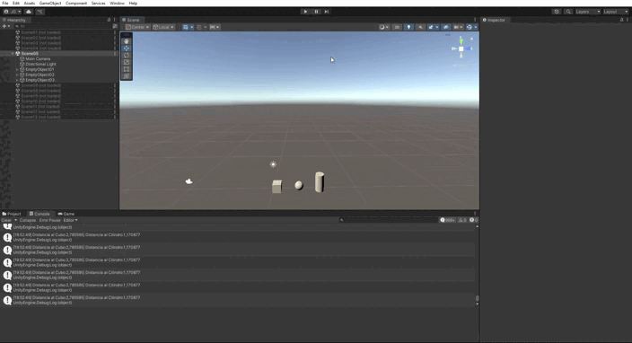
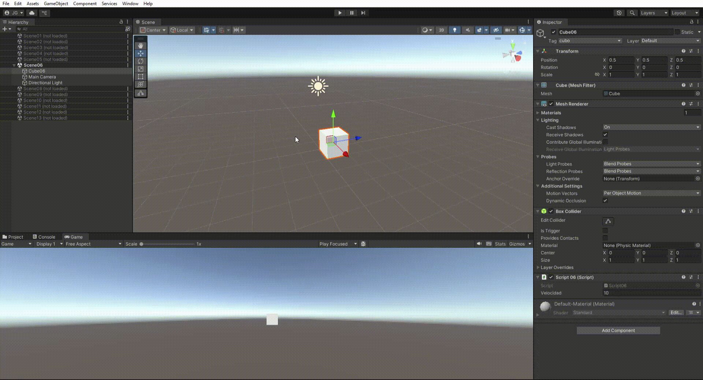
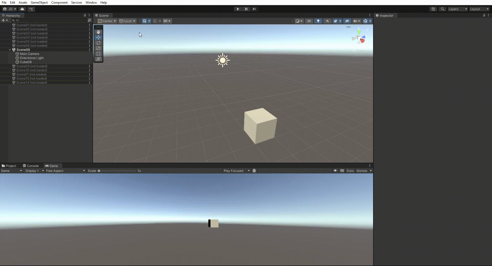
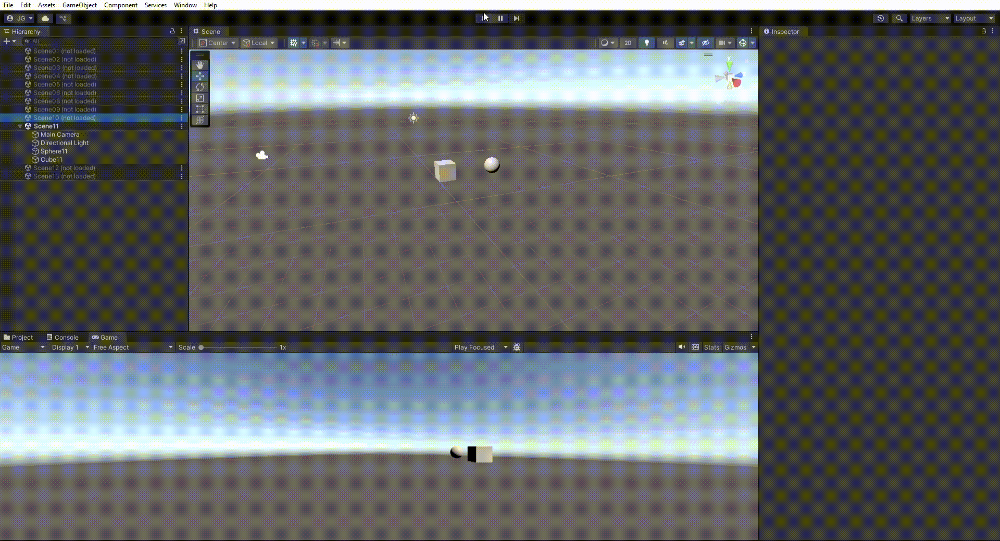

# Práctica 02: Scripts de Movimiento en Unity

Este repositorio contiene los scripts desarrollados para la práctica de scripts en Unity. A continuación se explica brevemente la funcionalidad de cada script y cómo se relaciona con los ejercicios propuestos en el enunciado.

## Ejercicio 1: Cambio de Color
**Script:** [`scripts/Script01.cs`](scripts/Script01.cs)  
Inicializa un vector de 3 posiciones como color (RGB) con valores aleatorios entre 0.0 y 1.0. Cada X frames (parametrizable desde el inspector) cambia aleatoriamente una de las componentes y actualiza el color del objeto. Utiliza la clase `Random` de Unity.  

## Ejercicio 2: Operaciones con Vectores
**Script:** [`scripts/Script02.cs`](scripts/Script02.cs)  
Define dos `Vector3` públicos configurables desde el inspector. Calcula y muestra en consola y en el inspector la magnitud de cada vector, el ángulo entre ellos, la distancia y cuál tiene mayor componente Y. También muestra en pantalla la posición de la esfera.  

## Ejercicio 3: Distancia entre Objetos
**Script:** [`scripts/Script03.cs`](scripts/Script03.cs)  

## Ejercicio 4: Posicionamiento con Marcadores
**Script:** [`scripts/Script04.cs`](scripts/Script04.cs)  
Calcula y muestra en consola la distancia entre la esfera y el cubo/cilindro, buscando la esfera por su etiqueta. 

## Ejercicio 5: Movimiento con Velocidad y Ejes
**Script:** [`scripts/Script05.cs`](scripts/Script05.cs)  
Un objeto invisible almacena tres posiciones configurables. Al pulsar la barra espaciadora, los objetos se ubican en esas posiciones desplazándose respecto a su posición original. 

## Ejercicio 6: Mapeo de Teclas
**Script:** [`scripts/Script06.cs`](scripts/Script06.cs) 
El cubo tiene una velocidad configurable. Al pulsar las flechas, muestra en consola el resultado de multiplicar la velocidad por el valor del eje correspondiente, indicando la flecha pulsada.  

## Ejercicio 7: Movimiento Proporcional a un Vector
**Script:** [`scripts/Script07.md`](scripts/Script07.md)  
Mapea la tecla H a la función de disparo usando el Input Manager.  

## Ejercicio 8: Movimiento con Teclas
**Script:** [`scripts/Script08.cs`](scripts/Script08.cs)  
El cubo se traslada proporcionalmente a un vector de dirección (`moveDirection`) y velocidad (`speed`), ambos configurables en el inspector. Se realizan pruebas variando dirección, velocidad y posición inicial, y se comenta el resultado en el informe.  

## Ejercicio 9: Movimiento Proporcional al Tiempo
**Script:** [`scripts/Script09.cs`](scripts/Script09.cs)
El cubo se traslada proporcionalmente a un vector de dirección (`moveDirection`) y velocidad (`speed`), ambos configurables en el inspector.

## Ejercicio 10: Movimiento hacia la Esfera
**Script:** [`scripts/Script10.cs`](scripts/Script10.cs)  
Adapta el movimiento para que sea proporcional al tiempo transcurrido entre frames usando `Time.deltaTime`. 

## Ejercicio 11: Cubo mirando a la Esfera
**Script:** [`scripts/Script11.cs`](scripts/Script11.cs)  
El cubo se mueve hacia la posición de la esfera, usando el vector normalizado que une ambos objetos, sin modificar la altura.  

## Ejercicio 12: Movimiento mirando a la Esfera (Espacio Local)
**Script:** [`scripts/Script12.cs`](scripts/Script12.cs) 
El cubo avanza siempre mirando hacia la esfera, rotando su eje Z positivo con `LookAt`. El movimiento se realiza en el espacio global y se prueba cambiando la posición de la esfera con WSAD.  

## Ejercicio 13: Giro y Avance con Eje Horizontal
**Script:** [`scripts/Script13.cs`](scripts/Script13.cs)  
El cubo avanza mirando siempre hacia la esfera, independientemente de la orientación de su sistema de referencia. Utiliza `Transform.LookAt` para que el eje Z positivo apunte hacia la esfera y realiza pruebas cambiando la posición de la esfera con las teclas AWSD. El movimiento se realiza relativo al espacio local del cubo.  

---

## Videos de Demostración

Los videos que muestran el funcionamiento de cada ejercicio están en la carpeta `vid` y enlazados en cada sección correspondiente.