# Práctica 03: Scripts de Movimiento en Unity

Este repositorio contiene los scripts desarrollados para la práctica de scripts en Unity. A continuación se explica brevemente la funcionalidad de cada script y cómo se relaciona con los ejercicios propuestos en el enunciado.

## Primera Parte:

### Situación 1:
**Descripción:**
El plano no es un objeto físico. El cubo es un objeto físico y la esfera no. En este caso, el plano y la esfera sólo tendrán collider, mientras que el cubo debe tener Rigidbody.   
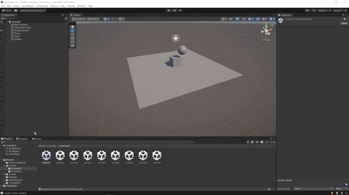

### Situación 2:
**Descripción:**
El plano no es un objeto físico. El cubo es un objeto físico y la esfera también. En este caso, el plano sólo tendrá collider, mientras que el cubo y la esfera deben tener Rigidbody.  
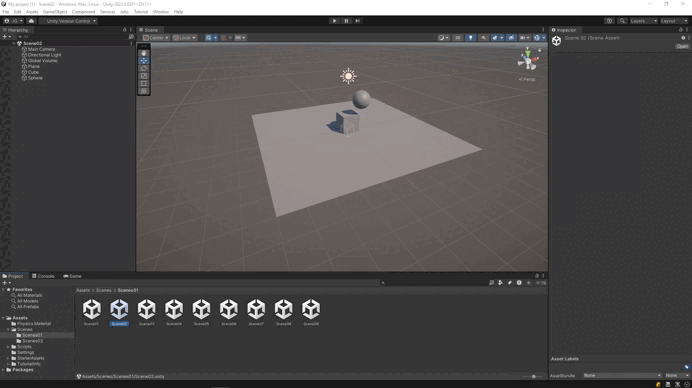

### Situación 3:
**Descripción:**
El plano no es un objeto físico. El cubo es un objeto físico y la esfera es cinemática. En este caso, el plano sólo tendrá collider, mientras que el cubo y la esfera deben tener Rigidbody; la esfera debe estar en modo cinemático (isKinematic = true).  
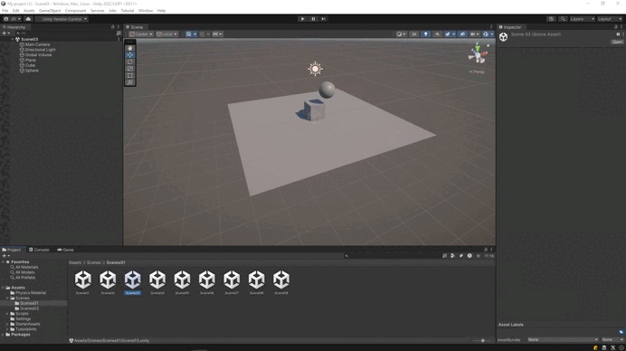

### Situación 4:
**Descripción:**
El plano es un objeto físico. El cubo es un objeto físico y la esfera es física. En este caso, todos los objetos deben tener Rigidbody.  
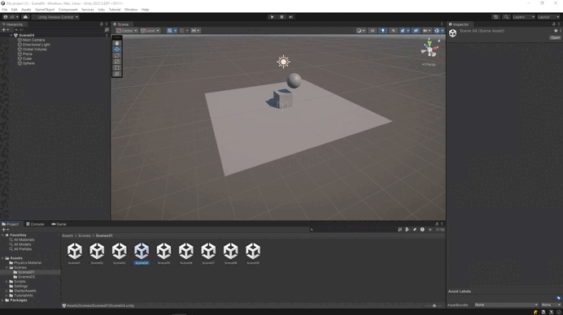

### Situación 5:
**Descripción:**
El plano es un objeto físico. El cubo es un objeto físico y la esfera es física con 10 veces más masa que el cubo. En este caso, todos los objetos deben tener Rigidbody (por ejemplo, si masa del cubo = 1, masa de la esfera = 10).  
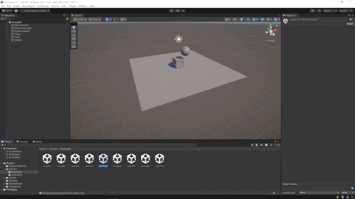

### Situación 6:
**Descripción:**
El plano es un objeto físico. El cubo es un objeto físico y la esfera es física con 100 veces más masa que el cubo. En este caso, todos los objetos deben tener Rigidbody (por ejemplo, si masa del cubo = 1, masa de la esfera = 100).  
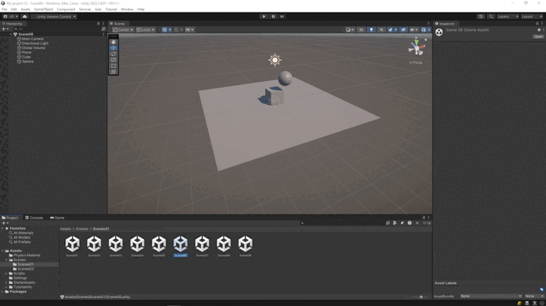

### Situación 7:
**Descripción:**
El plano es un objeto físico. El cubo es un objeto físico y la esfera es física con fricción. En este caso, todos los objetos deben tener Rigidbody; la esfera debe usar un PhysicMaterial con fricción ajustada para observar el efecto.  
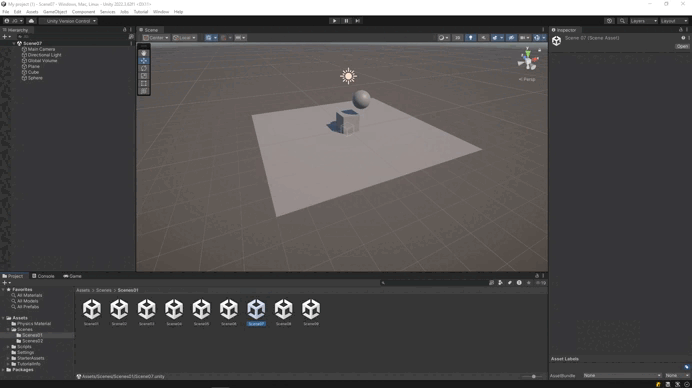

### Situación 8:
**Descripción:**
El plano es un objeto físico. El cubo es un objeto físico y la esfera no es física y es Trigger. En este caso, todos los objetos deben tener Rigidbody y la esfera debe tener su Collider marcado como Trigger (isTrigger = true).  
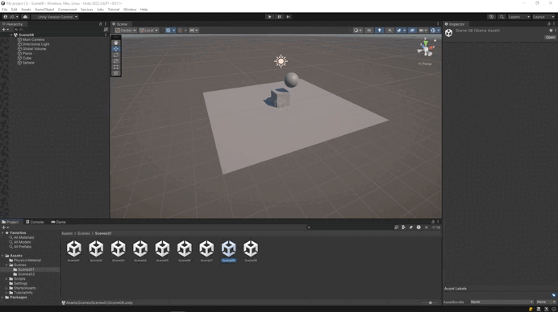

### Situación 9:
**Descripción:**
El plano es un objeto físico. El cubo es un objeto físico y la esfera es física y es Trigger. En este caso, todos los objetos deben tener Rigidbody y la esfera debe además tener su Collider marcado como Trigger (isTrigger = true).  
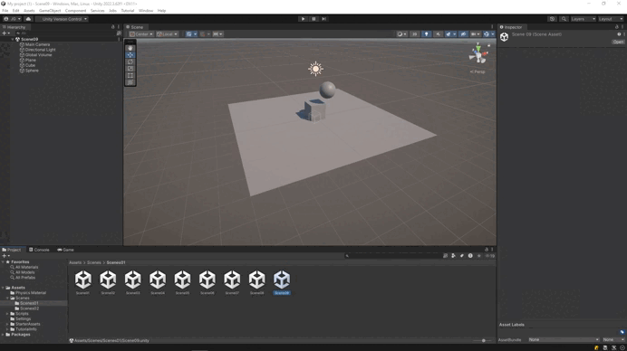

## Segunda Parte:

## Segunda Parte:

### Ejercicio 1:
**Script:** [`Script01`](src/Script01.cs)

**Descripción:**  
Crea un personaje controlable con teclas WASD / flechas. El personaje usa Rigidbody para que la física le afecte, pero el control permanece preciso.  
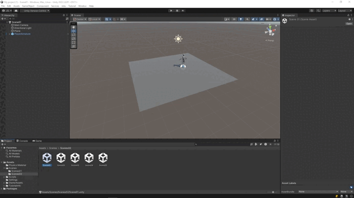

### Ejercicio 2:
**Script:** [`Script02`](src/Script02.cs)

**Descripción:**  
Crea varios cubos/esferas con Rigidbody dinámico. Al colisionar, muestra por consola el nombre del objeto colisionado y cambia su color.  

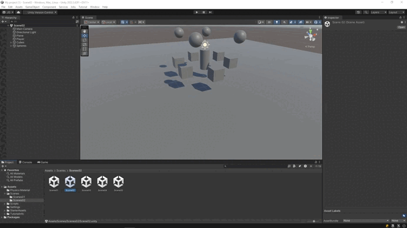

### Ejercicio 3:
**Script:** [`Script03-Player`](src/Scripts03/Script03-PlayerStats.cs)

**Script:** [`Script03-Zones`](src/Scripts03/Script03-Zone.cs)

**Descripción:**  
Crea una zona trigger (por ejemplo, un cubo grande con Is Trigger = true). Al entrar (OnTriggerEnter) cambia el color del personaje o activa un efecto de luz; al salir (OnTriggerExit) revierte el cambio. Añade otra zona que, al entrar, aumente una variable de daño (por ejemplo, damage += 10).  

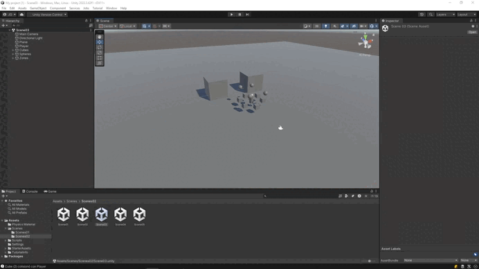

### Ejercicio 4:
**Descripción:**  
Crea tres capas distintas: Jugador, Enemigos, Recolectables. Configura la Layer Collision Matrix (Project Settings > Physics) para que:
- Enemigos colisionen únicamente con Jugador.
- Recolectables sean detectados solo por triggers (no colisiones físicas con enemigos).  

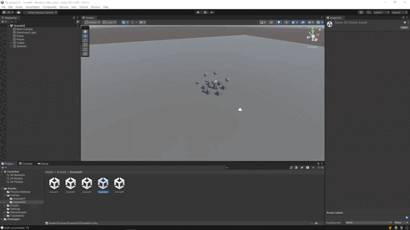

### Ejercicio 5:
**Script:** [`Script05`](src/Script05.cs)

**Descripción:**  
Crea materiales físicos diferentes (resbaladizo, rugoso, alto rebote) como PhysicMaterial assets. Asigna a distintos objetos y observa comportamiento al interactuar. Al pulsar la tecla X, lanzar objetos con AddForce() y comparar reacciones según el PhysicMaterial aplicado.  

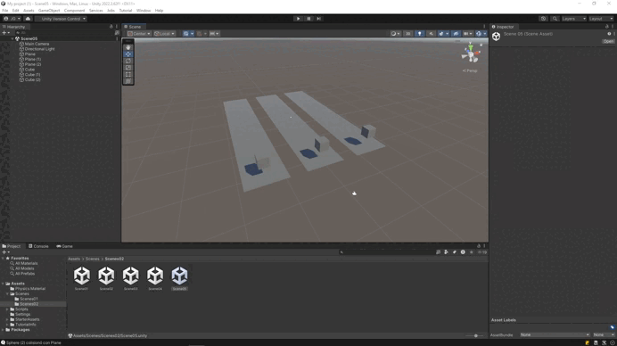

## Videos de Demostración

Los videos que muestran el funcionamiento de cada ejercicio están en la carpeta `vid` y enlazados en cada sección correspondiente.
