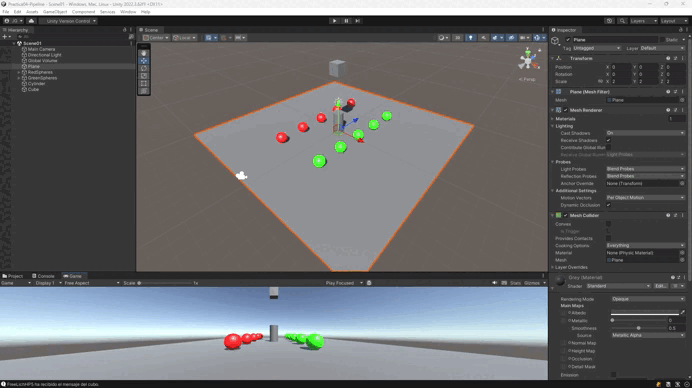
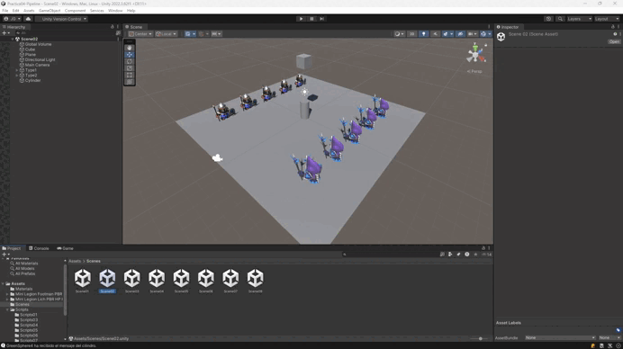
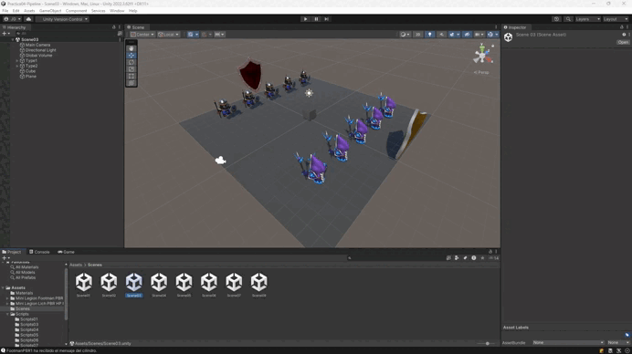
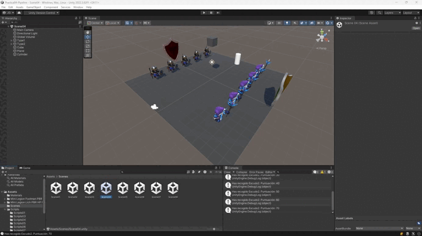
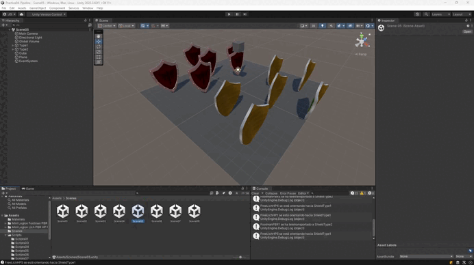
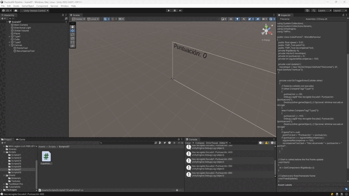
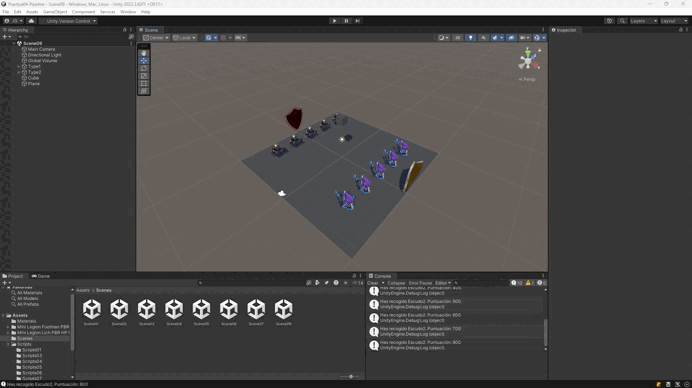
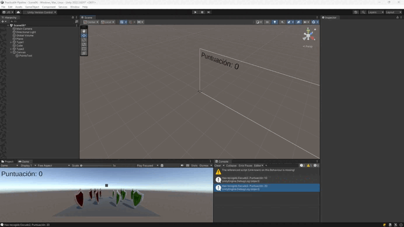

# Práctica 04: Delegados y Eventos

Este repositorio contiene los scripts desarrollados para la práctica de Delegados y Eventos en Unity. A continuación se explica brevemente la funcionalidad de cada script y cómo se relaciona con los ejercicios propuestos en el enunciado.

## Primera Parte:

### Situación 1:
**Scripts:** [`CilindroEmisor.cs`](src/Scripts01/CilindroEmisor.cs) [`ControlType1.cs`](src/Scripts01/ControlType1.cs)  [`ControlType2.cs`](src/Scripts01/ControlType2.cs)  

**Descripción:**
Crea una escena con 5 esferas, rojas que las etiquetas de tipo 1, y verdes de tipo 2. Añade un cubo y un cilindro. Crea la siguiente mecánica: cuando el cubo colisiona con el cilindro, las esferas de tipo 1 se dirigen hacia una de las esferas de tipo 2 que fijes de antemano y las esferas de tipo 2 se desplazan hacia el cilindro.

---

### Situación 2:
**Scripts:** [`CilindroEmisor.cs`](src/Scripts01/CilindroEmisor.cs) [`ControlType1.cs`](src/Scripts01/ControlType1.cs)  [`ControlType2.cs`](src/Scripts01/ControlType2.cs) 

**Descripción:**
Sustituye los objetos geométricos por humanoides  que encontrarás en el enlace y en este enlace.

---

### Situación 3:
**Scripts:** [`CuboEmisor.cs`](src/Scripts03/CuboEmisor.cs) [`ControlType1V3.cs`](src/Scripts03/ControlType1V3.cs)  [`ControlType2V3.cs`](src/Scripts03/ControlType2V3.cs)  

**Descripción:**
Adapta la escena anterior para que existan humanoides de tipo 1 y de tipo 2, así como diferentes tipos de escudos, tipo 1 y tipo 2:
Cuando el cubo colisiona con cualquier humanoide  tipo 2,  los del grupo 1 se acercan a un escudo seleccionado. Cuando el cubo toca cualquier humanoide del grupo 1 se dirigen hacia los escudos del grupo 2 que serán objetos físicos. Si algún humanoide a colisiona con uno de ellos debe cambiar de color.

---

### Situación 4:
**Scripts:** [`ControlTypes.cs`](src/Scripts04/ControlTypes.cs) [`CuboEmisorV4.cs`](src/Scripts04/CuboEmisorV4.cs)

**Descripción:**
Cuando el cubo se aproxima al objeto de referencia, los humanoides del grupo 1 se teletransportan a un escudo objetivo que debes fijar de antemano.Los humanoides del grupo 2 se orientan hacia un objeto ubicado en la escena con ese propósito.

---

### Situación 5:
**Scripts:** [`CuboPoints.cs`](src/Scripts05/CuboPoints.cs)

**Descripción:**
Implementar la mecánica de recolectar escudos en la escena que actualicen la puntuación del jugador. Los escudos de tipo 1 suman 5 puntos y los de tipo 2 suman 10. Mostrar la puntuación en la consola.

---

### Situación 6:
**Scripts:** [`CuboPoints6.cs`](src/Scripts06/CuboPoints6.cs)

**Descripción:**
Partiendo del script anterior crea una interfaz que muestre la puntuación que va obteniendo el cubo. 

---

### Situación 7:
**Scripts:** [`CuboPoints7.cs`](src/Scripts07/CuboPoints7.cs)

**Descripción:**
Partiendo de los ejercicios anteriores, implementa una mecánica en la que cada 100 puntos el jugador obtenga una recompensa que se muestre en la UI. 

---

### Situación 9:
**Scripts:** [`CuboEmisorV9.cs`](src/Scripts09/CuboEmisorV9.cs) [`ControlType1V9.cs`](src/Scripts09/ControlType1V9.cs)  [`ControlType2V9.cs`](src/Scripts09/ControlType2V9.cs)  

**Descripción:**
Implementa el ejercicio 3 siendo el cubo un objeto físico.  

