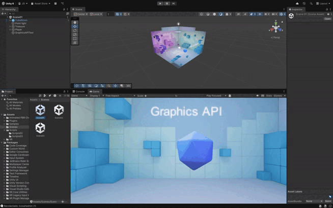
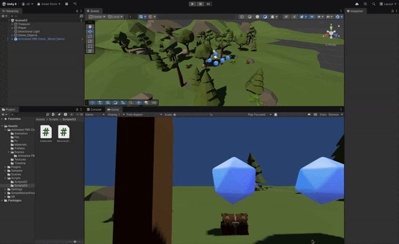

# Práctica 02: Scripts de Movimiento en Unity

Este repositorio contiene los scripts desarrollados para la práctica de scripts en Unity. A continuación se explica brevemente la funcionalidad de cada script y cómo se relaciona con los ejercicios propuestos en el enunciado.

## Primera Parte:

### Situación 1:
**Scripts:** [`CilindroEmisor.cs`](src/Scripts01/CilindroEmisor.cs) [`ControlType1.cs`](src/Scripts01/ControlType1.cs)  [`ControlType2.cs`](src/Scripts01/ControlType2.cs)  

**Descripción:**
Crear el proyecto Cardboard y experimentar y generar una apk para Android.

---

### Situación 2:
**Scripts:** [`PlayerMovement.cs`](src/Scripts02/PlayerMovement.cs) [`MouseLook.cs`](src/Scripts02/MouseLook.cs)  [`GazeCollect.cs`](src/Scripts01/GazeCollect.cs) 

**Descripción:**
Crea una escena con Cardboard que tenga objetos que al llegar el jugador a ellos los recolecte con la vista. El jugador se puede desplazar con un mando o con la vista. La escena debe contener un terreno y objetos de algún paquete de la Asset Store.

*Nota:* El video no corresponde al resultado final, debido a que github tiene un peso máximo de subida se ha reducido el video del entorno para poder mostrar la utilidad básica del ejercicio. En el siguiente ejercicio se puede ver el entorno creado añadiendo paquetes de la Asset Store.

---

### Situación 3:
**Scripts:** [`Collectible.cs`](src/Scripts03/Collectible.cs) [`RecoveryPoint.cs`](src/Scripts03/RecoveryPoint.cs)

**Descripción:**
Elige un objeto en la escena que sirva para recuperar los que se recolectan. Cuando el jugador lo selecciona con la vista los recolectables se dirigen hacie el jugador.

---
