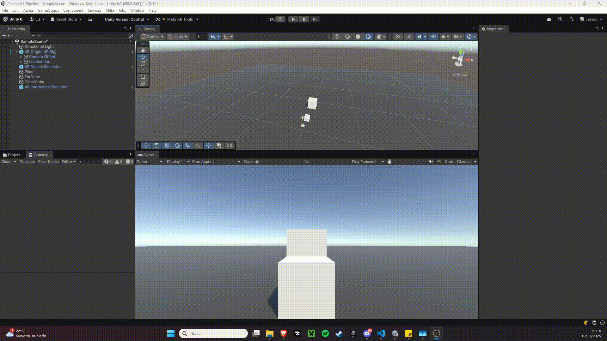

# Práctica 06: XR Interaction Toolkit y Meta XR

---

**Scripts:** [`ColorOnSelect.cs`](src/ColorOnSelect.cs) [`LogOnGrab.cs`](src/LogOnGrab.cs)

**Descripción:**
Agrega en la escena dos cubos sobre un plano, uno lejano y otro cercano. El lejano será un Ray Interactor que cambia de color al seleccionarlo. El cercano será un Direct Interactor que muestra un mensaje en consola al agarrarlo.

---